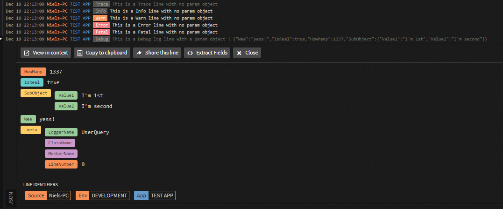

# NLOG.Target.LogDNA
**A simple `NLog` target for the LogDNA service written in .Net Standard 2.0**

**This requires the NLog NuGet package to be installed.**

# LogDNA
LogDNA is a simple and affordable cloud logging provider that will scale all the way from hobby to enterprise!
You can check them out here: [LogDNA](https://logdna.com) 
I have only good experiences with them, and their support is awesome.

_This is 100% my personal oppinion! I am in no way affiliated or a representative with LogDNA!
I am just a guy using their service for my projects._

# Installation
Simply download and install via NuGet

[NuGet Package](https://www.nuget.org/packages/ITNiels.NLog.Targets.LogDNA)

```powershell
    Install-Package ITNiels.NLog.Targets.LogDNA
```

# Setup using code is easy
To setup the logger in code add the following to you program.cs or other starting point

```C#
// Create a new Config object
var config = new NLog.Config.LoggingConfiguration();

// Setup the LogDNA target
var logDna = new NLog.Targets.LogDnaTarget("logdna") {
    LogDnaIngestionKey = "<LogDNA Key>",
    LogDnaAppname = "My App",
    LogDnaHostname = "My Server",
    LogDnaEnvironment = "PRODUCTION"
};

// Register the LogDNA Target
config.AddRule(LogLevel.Trace, LogLevel.Fatal, logDna);

// Set configuration
LogManager.Configuration = config;
```

## Making it async

A lot of times we don't want our code to be waiting for logging, this can especially be a problem if the ingestion service has problems, then your program will wait for timeout before continuing.

Making it `async` is super easy using the builtin AsyncTargetWrapper.
Just replace the line above where we add the rule with the following:

```C#
// Register the LogDNA Target using async
config.AddRule(LogLevel.Trace, LogLevel.Fatal, new AsyncTargetWrapper(logDna, 5000, AsyncTargetWrapperOverflowAction.Discard));
```

# Setup using config

```xml
<!-- Add extension so reflection can find the target dll-->
<extensions>
    <add assembly="NLog.Targets.LogDNA"/>
</extensions>

<!-- Add the target-->
<targets>
    <target name="logdna" xsi:type="LogDNA">
        <!-- Required -->
        <IngestionKey>Your Key</IngestionKey>
        <Appname>My App</Appname>
        <Hostname>My Server</Hostname>

        <!-- Optional -->
        <Environment>PRODUCTION</Environment>
        <Tags>web,app,summer</Tags>
    </target>
</targets>
```
## Making it async
A lot of times we don't want our code to be waiting for logging, this can especially be a problem if the ingestion service has problems, then your program will wait for timeout before continuing.

Simply add `async="true"` to the targets node like this:
```xml
<targets async="true">
    <target...>
</targets>
```

# Using the logger
Simply create a new logger in the class you need it:

```C#
class MyClass {
    private static ILogger Logger = LogManager.GetCurrentClassLogger();

    public MyMethod(){
        Logger.Info("MyMethod works <3");
    }
}
```

# How it looks in LogDNA

** All lines can contain one or more param objects that will be json parsed.

# FAQ

## Does it support async?
Yes it does. Just use the `AsyncTargetWrapper` that is built into NLog.

## Why NLog?
NLog is a fast and modern logging framework with great support for all types of applications.

## How can I support this?
You can help me out on my [Patreon](https://patreon.com) or get involved.

## Can I use this commercially?
Absolutely! 100% free and opensource

## How can i get involed?
Simply open an issue, make a pullrequest or shoot me a message 😊